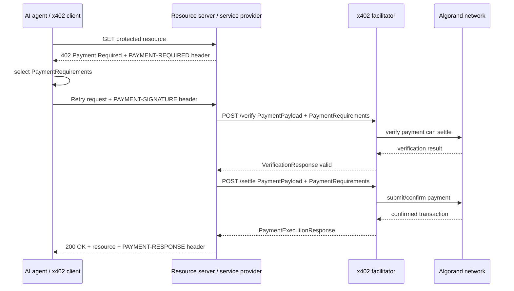
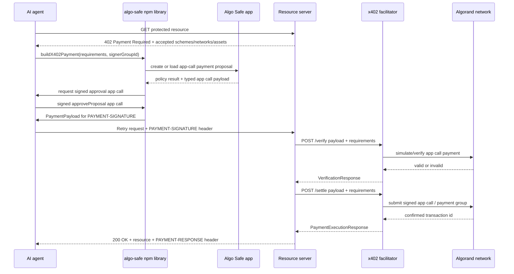
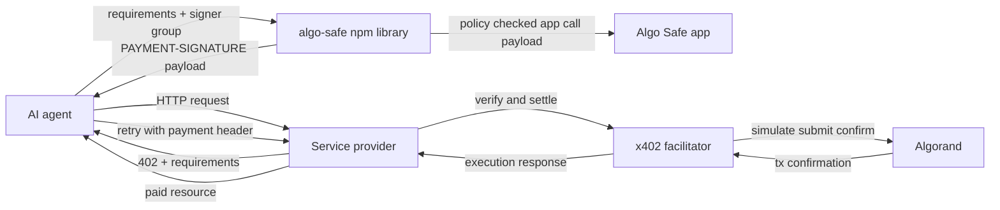
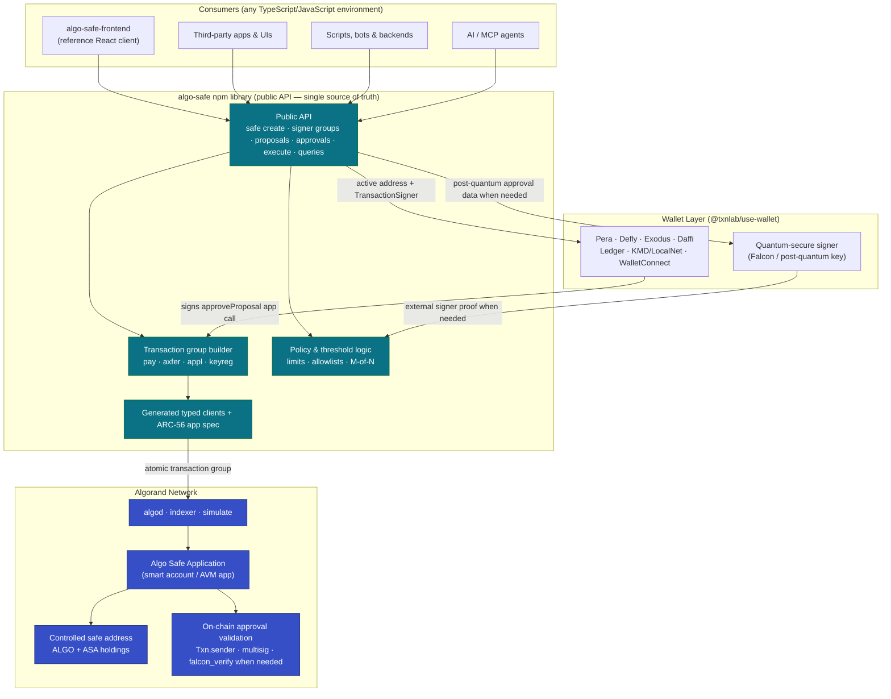
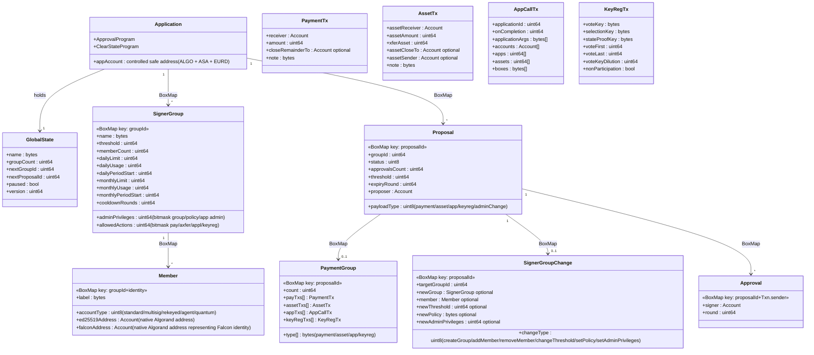
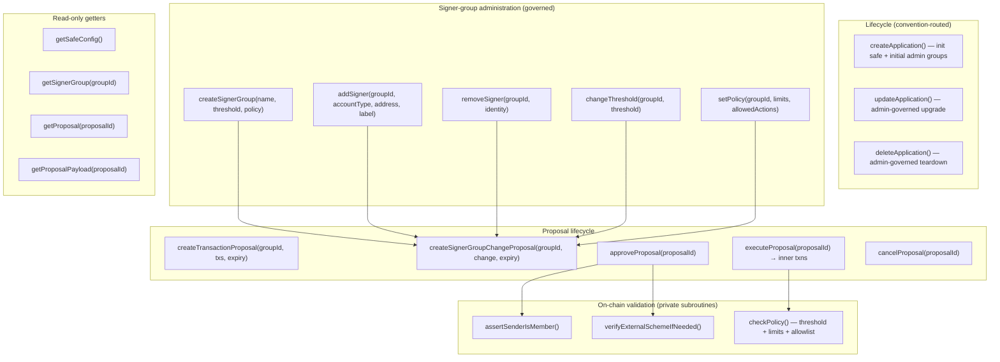
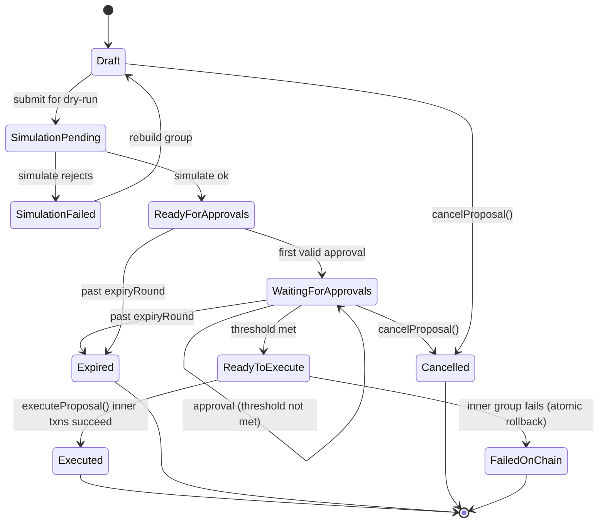
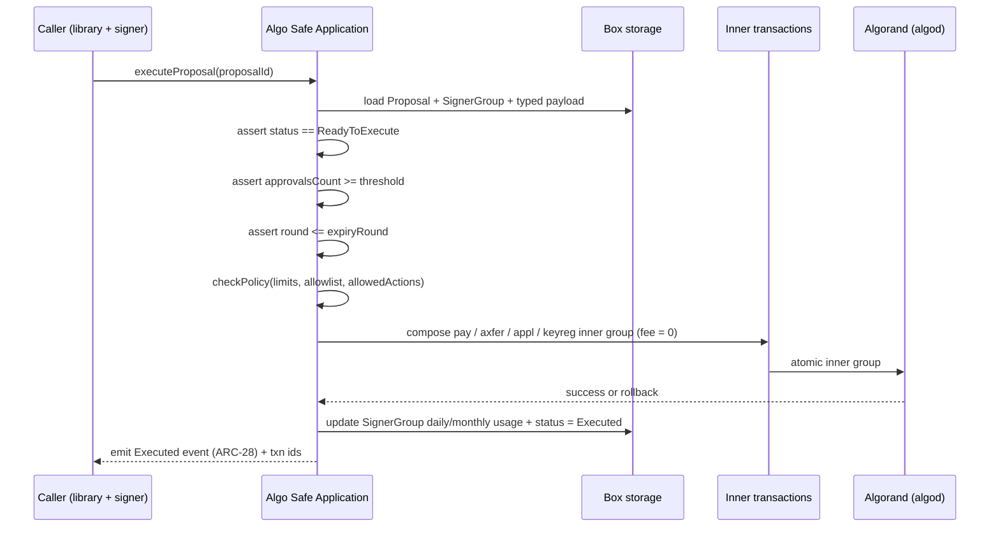

# Algo Safe

**Policy-Driven Smart Accounts for the Agent Economy**

Algo Safe is designed for the emerging agent economy, allowing AI agents to operate within predefined on-chain policies on Algorand. These policies define what agents can access, spend, and execute, ensuring actions remain transparent and controlled. By supporting standards such as x402, agents can securely authorize actions, pay for services, and access paid APIs while staying within approved spending and governance rules.

* Policy-Controlled Accounts for AI Agents on Algorand
* Secure AI Agent Wallets and Treasuries on Algorand
* Programmable Accounts for Humans and AI Agents

**A policy-driven smart account for Algorand teams, treasuries, builders, validators, and AI agents.**

Algo Safe is an on-chain safe for Algorand: a wallet-like smart account controlled by configurable signer groups, spending rules, and transparent transaction proposals. It is inspired by the operational safety of products like Safe on EVM chains, but designed around Algorand-native primitives: fast finality, atomic transaction groups, application calls, Algorand Standard Assets, participation key management, and wallet signing through the Algorand wallet ecosystem.

The goal is simple: make it easy for humans and automated agents to prepare, review, co-sign, and execute authorized Algorand actions without forcing users to reason directly about raw transaction bytes.

---

## Why Algorand Users Need This

Algorand already supports powerful transaction composition, but the user experience for shared custody is still too manual for many real teams. Treasury operators, DAOs, startups, validators, payment agents, and protocol maintainers need a frontend that turns low-level Algorand concepts into safe workflows.

Common needs:

- **Shared custody without operational chaos**: Teams need M-of-N approval, clear roles, and a reliable way to rotate members without moving funds to a new account each time.
- **Wallet compatibility**: Users should connect with familiar Algorand wallets through `@txnlab/use-wallet`, including Pera, Defly, Exodus, Daffi, LocalNet/KMD, and WalletConnect-capable providers where supported.
- **Atomic transaction clarity**: Algorand transaction groups are all-or-nothing. Users need to see the exact ordered payload and inner transaction group preview before signing, including payments, ASA transfers, application calls, and key registration transactions.
- **Application-call-first UX**: dApps often need the safe to authorize a single high-level action that expands into a complete atomic group. The UI should let a user prepare one safe execution request, then review the resulting group before collecting signed approval app calls.
- **ASA-aware treasury management**: Teams hold ALGO and many ASAs. The safe must show asset balances, opt-in requirements, decimals, metadata, and receiver readiness.
- **Validator and governance operations**: Algorand accounts may need key registration (`keyreg`) and governance-related actions. These should be approvable through the same policy flow as payments.
- **Agentic payments with limits**: AI agents and automation services need constrained budgets. Humans should be able to delegate low-risk spending while keeping high-risk actions behind stricter signer groups.
- **Failure-resistant approval**: Signers may use different wallets, devices, and networks. The frontend must recover from disconnects, stale rounds, rejected approval app calls, indexer lag, and partially collected approvals.

---

## Product Vision

Algo Safe should become the default custody and coordination layer for serious Algorand accounts.

It should feel like a professional treasury console, not a developer demo. A signer should be able to connect a wallet, understand what is pending, inspect exactly what will happen on-chain, sign only what they intend to approve, and leave. An admin should be able to create signer groups, add or remove members, change thresholds, and enforce policy without hand-crafting transactions.

Longer term, Algo Safe can also support post-quantum signer schemes and agent-controlled accounts, giving Algorand users a path toward future-proof custody and automated payments without giving up on-chain enforcement.

---

## Core Concepts

### Safe Account

A safe is an Algorand smart account governed by an application. The safe owns or controls assets and executes approved actions only when policy requirements are satisfied.

Each safe has:

- A name and description
- A network (`localnet`, `testnet`, or `mainnet`)
- An application ID after deployment
- One or more signer groups
- Policy rules for thresholds, spending limits, and administration
- A transaction history and proposal queue

### Signer Groups

A signer group is a named set of accounts with an approval threshold. A safe can have multiple signer groups with administrative privileges; admin power is not limited to a single hardcoded group. Each group declares the actions it can approve, whether it can administer safe configuration, and the spending limits that apply to actions executed through that group.

Examples:

| Group | Members | Threshold | Purpose |
| --- | --- | --- | --- |
| Admins | 5 human accounts | 3-of-5 | Safe configuration, upgrades, high-value transactions |
| Treasury | 3 finance operators | 2-of-3 | Recurring operational payments and ASA transfers |
| Validator Ops | 2 operators | 2-of-2 | Key registration and participation-key actions |
| Agent | 1 automation account | 1-of-1 | Low-value automated payments within daily limits |

Signer groups must be first-class objects in both the contract model and the frontend. Users should never have to infer group state from raw addresses. Any change to signer groups, thresholds, admin privileges, or policies must itself be represented as a co-signed governed proposal so the contract can enforce administrative changes with the same threshold rules as fund movement.

### Account Types

When a user adds an account to a signer group, they choose an account type. The safe treats account type as metadata plus a verification rule, so different cryptographic schemes can coexist in the same safe.

Supported account types:

- **Standard account**: A normal Ed25519 Algorand account controlled by a single key (Pera, Defly, Exodus, Daffi, Ledger, KMD, etc.).
- **Multisig account**: An Algorand multisignature account with its own ordered addresses, threshold, and version.
- **Rekeyed / operational account**: An account whose authorization address has been rekeyed for operational control.
- **Agent account**: An automation/MCP-controlled account constrained by strict policy limits.
- **Quantum-secure account**: A post-quantum account whose signatures are verified against a quantum-resistant scheme.

#### Quantum-Secure Accounts

Algorand is designed with post-quantum security in mind. The network already uses **Falcon** (a NIST-selected post-quantum signature scheme) to secure **State Proofs**, and the AVM exposes a **`falcon_verify`** opcode that lets smart contracts and logic signatures verify FALCON-1024 post-quantum signatures on-chain.

Algo Safe makes the **quantum-secure account a first-class account type** that users can add to any signer group:

- A quantum-secure signer is authorized by a post-quantum (Falcon) key, not only by a classical Ed25519 key.
- Approval of that signer's portion of a proposal is verified by the signed approval app call, with post-quantum verification used only for account types that cannot be authenticated directly by the transaction sender.
- A quantum-secure account can be a sole signer, or combined with standard, multisig, and agent accounts in the same group for hybrid classical + post-quantum security.
- The frontend submits approvals through the `algo-safe` library, so the UX of adding, approving, and removing a quantum-secure signer matches the standard flow.

This lets teams future-proof high-value safes against quantum attacks while keeping the same approval, policy, and audit experience.

### Spending And Action Policies

Policies determine what a signer group can approve.

Policy examples:

- Daily ALGO limit per signer group
- Monthly ALGO limit per signer group
- Per-ASA transfer limits
- Allowed receiver lists for agent spending
- Required admin approval for unknown receivers
- Required admin approval for `keyreg`, application update/delete, close-out, or large ASA transfers
- Cooldown period for signer removal or threshold changes

Daily and monthly limits store their current usage directly in the signer group record. The contract must update the group's current daily and monthly usage whenever a proposal executes a movement of value, including ALGO payments and ASA transfers that are counted by policy. Limit usage is not stored in a separate box.

### Transaction Proposals

A proposal is a human-readable request to execute one or more Algorand transactions or one administrative safe change.

Every proposal must show:

- Proposal title and purpose
- Requested signer group
- Current approval progress
- Required threshold
- Exact typed payload and inner transaction group preview
- Human-readable effects
- Raw transaction details for advanced users
- Simulation result where available
- Expiration round or time
- Network and genesis hash

Proposals do not store a `groupTxnHash`. The approved content is the typed proposal payload itself: payment, asset transfer, application call, key registration, or signer-group administration. On execution, the contract emits the approved payload as an AVM inner transaction group from the application account.

---

## Supported Algorand Actions

Algo Safe should support the actions Algorand users actually need, starting with these core transaction types:

- **Payment (`pay`)**: Send ALGO, fund accounts, pay service providers, close accounts only when explicitly allowed.
- **Asset transfer (`axfer`)**: Send ASAs, opt in to assets, opt out of assets, and handle ASA decimals safely.
- **Application call (`appl`)**: Call dApps, governance contracts, DeFi protocols, and the Algo Safe contract itself.
- **Key registration (`keyreg`)**: Register participation keys, go online/offline, and manage validator participation workflows.

Algorand atomic groups may contain a mix of transaction types. The frontend must make that power understandable instead of hiding it.

---

## x402 Agent Payment Flow

x402 is an HTTP-native payment protocol built around `402 Payment Required`. A service provider protects a resource, the AI agent requests it, the provider returns payment requirements, and the agent retries the request with a signed payment payload. The important correction is that the agent normally sends the signed `PAYMENT-SIGNATURE` back to the resource server, not directly to the facilitator. The resource server then asks the facilitator to verify and settle the payment, and the facilitator returns settlement confirmation to the resource server.

For Algo Safe, the agent does not hand-build the Algorand payment. It calls the `algo-safe` npm library, which builds an app-call-based safe execution request, checks the signer-group policy, submits the required signed approval app call, and returns the x402 payment payload that can be sent with the retried HTTP request.

### Standard x402 Flow



### Algo Safe x402 Flow



### Component Responsibilities



### Protocol Notes

- The service provider advertises price, network, scheme, recipient, asset, and any facilitator details in the `402 Payment Required` response.
- The agent retries the original request with `PAYMENT-SIGNATURE`; the resource server remains the HTTP counterparty for the paid resource.
- The facilitator verifies and settles payments for the resource server. This keeps the provider from running its own Algorand infrastructure.
- On Algorand, the x402 payment payload can represent the safe-approved app call or transaction group needed to transfer value under the selected x402 scheme and network.
- The `algo-safe` library is responsible for turning the x402 payment requirements into a governed safe proposal/app call, enforcing daily and monthly signer-group usage, submitting the safe signer approval app call, and exposing the final payload to the agent.

---

## EURD Onramp And Offramp (Quantoz)

Algo Safe integrates **EURD**, the regulated euro stablecoin issued by **Quantoz Payments B.V.** (Netherlands), so teams can fund and defund their safe with real euros without leaving the custody workflow. EURD is electronic money compliant with the European **Electronic Money Directive (EMD)** and, when issued as an e-money token (EMT), with the **Markets in Crypto-Assets Regulation (MiCAR)**. Holders have a right of redemption against the issuer at any time and at par value. On Algorand, EURD is an Algorand Standard Asset (ASA ID `1221682136`), so it behaves like any other ASA inside the safe while remaining fully fiat-backed (1:1 reserves held in segregated accounts with Tier 1 banks and AAA EU government bonds).

This makes EURD a natural treasury asset for an Algorand safe: an **onramp** converts incoming EUR (via SEPA/bank transfer) into EURD delivered to the safe's controlled address, and an **offramp** redeems EURD held by the safe back into EUR paid out to a bank account.

### Integration Model

Algo Safe consumes the **Quantoz Payments API** documented at `https://portal.quantozpay.com/documentation`. Quantoz exposes three integration models; Algo Safe targets the **blockchain-based EUR accounts on Algorand** model (self-hosted wallets), with optional support for the **embedded payments** model where a partner acts on behalf of end users.

As with every other capability, the frontend never calls the Quantoz API or constructs EURD transfers directly. EURD onramp/offramp is exposed **only through the `algo-safe` npm library**, which:

- Wraps the Quantoz Payments REST API behind typed, documented methods.
- Builds and previews the resulting Algorand atomic groups (for example the ASA opt-in to EURD and any required application calls) so they pass through the same proposal, policy, and approval flow as any other safe action.
- Hands wallet signing back to the caller's `TransactionSigner`; the library never holds keys or banking credentials.
- Keeps Quantoz API keys/secrets server-side, never embedded in the reference frontend bundle.

### Onramp (Buy / Mint EURD Into The Safe)

Purpose: turn EUR into EURD credited to the safe's controlled Algorand address.

Flow:

1. Operator chooses **Add funds (EURD)** and enters a target amount.
2. The library ensures the safe is **opted in** to the EURD ASA, proposing an `axfer` opt-in transaction through the normal governed flow if needed.
3. The library requests onramp instructions from Quantoz (deposit reference / SEPA details, or an embedded-payment authorization, depending on the integration model).
4. The operator (or partner) completes the EUR deposit.
5. Quantoz mints/issues EURD and transfers it to the safe's controlled address on Algorand.
6. The dashboard reflects the new EURD balance once on-chain and Quantoz settlement confirm.

Requirements:

- Show KYC/onboarding state required by Quantoz before an onramp can proceed, in plain language.
- Show deposit reference, expected settlement time, fees, and minimums returned by the API.
- Track onramp requests as first-class items with states: `initiated`, `awaiting EUR deposit`, `EUR received`, `EURD issued`, `settled on-chain`, `failed`, `expired`.
- Surface the EURD ASA id, decimals, and opt-in status exactly like any other ASA.

### Offramp (Sell / Redeem EURD Out Of The Safe)

Purpose: redeem EURD held by the safe back into EUR paid to a bank account.

Flow:

1. Operator chooses **Withdraw to EUR (EURD)**, enters an amount, and selects a verified payout IBAN.
2. The library builds the EURD redemption as a **governed proposal**: the EURD `axfer` (and any required `appl`) is previewed as an exact atomic group and routed through the safe's signer groups and policies.
3. Required signers approve under the normal M-of-N threshold.
4. On execution, EURD leaves the safe to the Quantoz redemption address on Algorand.
5. Quantoz burns/redeems the EURD and pays out EUR to the destination bank account.
6. The activity log records the on-chain txn id together with the Quantoz redemption reference.

Requirements:

- Redemption must respect the safe's spending limits, allowlists, and admin-approval rules (for example treating a payout IBAN like an allowlisted receiver).
- Show payout IBAN, fees, minimums, expected EUR settlement time, and the redemption reference.
- Track offramp requests with states: `proposed`, `awaiting approvals`, `EURD sent on-chain`, `redeemed`, `EUR paid out`, `failed`, `cancelled`.
- Flag the EURD redemption recipient address as a known, verified Quantoz address so signers can review it confidently.

### Why This Belongs In The Safe

- **Treasury completeness**: teams can move between EUR and on-chain value under the same M-of-N approval, policy, and audit guarantees as payments and ASA transfers.
- **Agent budgets in euros**: agent signer groups can be funded with EURD and constrained by the same daily/monthly limits, enabling euro-denominated agentic payments.
- **One audit trail**: every onramp and offramp appears in the activity log alongside the proposals, approval app calls, and executed transaction ids that authorized it.
- **Boundary preserved**: third-party apps, scripts, and AI/MCP agents get the same EURD onramp/offramp by calling the `algo-safe` library, never the Quantoz API directly.

---

## Packaging And Architecture

Algo Safe is delivered as two layers with a strict boundary between them. Every consumer — the reference frontend, third-party apps, automation scripts, and AI/MCP agents — interacts with a safe **only** through the `algo-safe` npm library. The library is the single source of truth that builds, simulates, and submits Algorand atomic transaction groups; callers hand it a wallet `TransactionSigner` and never assemble raw transactions themselves.

### Architecture Diagram



**Boundary rule:** consumers call only the library's public API. The library owns transaction building, policy enforcement, signing handoff, and on-chain submission, so the frontend, third parties, and agents all share identical, audited logic.

### `algo-safe` npm Library (from `algo-safe-contracts`)

The output of `algo-safe-contracts` is a reusable, publishable **npm library** named `algo-safe` that anyone can install and use, not just this project's frontend.

The library must:

- Compile the Algorand TypeScript smart contracts and ship the ARC-56 app spec(s) and generated typed clients.
- Export a stable, documented, semver-versioned public API surface.
- Provide high-level methods for every safe operation, including safe creation, signer-group management, proposal building, approval/co-signing, execution, read/query helpers, and EURD onramp/offramp via the Quantoz Payments API.
- Build the exact Algorand atomic transaction groups (`pay`, `axfer`, `appl`, `keyreg`) internally so callers never assemble raw transactions by hand.
- Accept a wallet/signer handoff (for example an Algorand `TransactionSigner`) so the library performs signing through the caller's wallet rather than holding keys.
- Be framework-agnostic and usable from any TypeScript/JavaScript environment: web frontends, Node.js backends, scripts, bots, and AI/MCP agents.
- Hide AVM and ARC-56 implementation details behind typed methods, while still exposing the assembled transaction group for inspection.

The library is the single source of truth for how to interact with an Algo Safe. Any third party can build their own UI, automation, or integration on top of it.

### Frontend (`algo-safe-frontend`)

The frontend is a **reference client** of the `algo-safe` npm library and nothing more.

Hard requirements:

- The frontend must interact with Algo Safe **exclusively through methods exported by the `algo-safe` npm library**.
- The frontend must not import generated contract clients directly, hand-build transactions, hardcode ABI method selectors, or construct atomic groups on its own.
- All safe reads, proposal building, signing, and execution must go through the library's public API.
- Wallet connection (via `@txnlab/use-wallet`) only provides the active address and `TransactionSigner`, which are handed to the library; the library does the rest.
- If the frontend needs a new capability, it must be added to the library's public API first, then consumed by the frontend.

This boundary guarantees that the frontend, third-party apps, and automated agents all share identical, audited transaction-building and policy logic.

---

## Smart Contract Model

This section is the on-chain model from which the Algo Safe Algorand smart contract is constructed. It reflects how the Algorand Virtual Machine (AVM) actually works, so the contract maps cleanly onto AVM primitives instead of fighting them.

### AVM Grounding

The contract is written in **Algorand TypeScript** (PuyaTs) and compiled to **TEAL / AVM bytecode**; it is not normal TypeScript. The model is constrained by AVM realities:

- **One application, two programs.** Every Algorand app is an **Approval Program** (all app calls except ClearState) plus a **Clear State Program** (cleanup only). No critical authorization logic lives in Clear State, because users can always clear their local state.
- **Two fundamental types.** At the AVM level everything is `uint64` or `bytes` (≤ 4096 bytes). Higher-level shapes (structs, addresses, ABI tuples) are ARC-4 encodings over `bytes`.
- **The safe address is the application account.** The smart account that holds ALGO and ASAs (including EURD) is the **application's account**. All payments, ASA transfers, app calls, and key registrations are executed as **inner transactions** signed by the application, each with `fee: 0` (the caller covers fees via fee pooling).
- **No re-entrancy.** An application cannot call itself, even indirectly through inner transactions; the AVM enforces this.
- **Hard limits drive storage choices.** Global state is capped (64 KV pairs, key+value <= 128 bytes), so per-group, per-member, per-proposal, and per-approval records live in **box storage** (`Box` / `BoxMap`), whose MBR is funded by the app account. A transaction group is at most 16 transactions; the opcode budget is 700 per app call, pooled across the group and inner app calls.
- **Approval authentication comes from the signed app call.** A standard approval is an `approveProposal` application call signed by the signer account. The AVM has already verified the transaction signature before the approval program runs, so the contract checks `Txn.sender` against the signer group and records only the approval fact. The `Approval` box never stores a signature. Explicit opcodes such as `falcon_verify` are used only for signer types that cannot be authenticated directly as the transaction sender.

### Storage Layout

The application keeps a small fixed **global state** for configuration and counters, and uses **box storage** for the unbounded, per-entity records (signer groups, members, proposals, approvals, typed transaction payloads, and signer-group change payloads). Composite box keys give O(1) lookups without account opt-in. Daily and monthly usage counters live inside each signer group's box value; there is no separate `LimitUsage` box.



`PaymentGroup` is intentionally named for the executable group shape used by the contract, even though it can contain payment, asset transfer, application call, and key registration entries. The arrays are parallel by index: `type[i]` selects which typed transaction array is read at position `i`, and execution composes the matching inner transaction fields with the correct `TransactionType`.

### ABI Method Surface

Convention-based lifecycle methods handle create/update/delete; the rest are ARC-4 ABI methods grouped by responsibility. Read-only getters use `@abimethod({ readonly: true })` so clients can query without a state-changing call.



Every administrative change (`createSignerGroup`, `addSigner`, `removeSigner`, `changeThreshold`, `setPolicy`, `setAdminPrivileges`, update/delete) is itself a **governed action**: it is created as a signer-group change proposal, approved by any signer group that has the required admin privilege under M-of-N, and only then executed. The contract never trusts a single caller for privileged changes, and it supports more than one admin-capable signer group.

### Proposal State Machine

A proposal carries the **exact typed payload** it authorizes. A signer approves by submitting a signed `approveProposal(proposalId)` app call from the signer account. The blockchain validates that transaction signature before contract logic runs; the contract then checks that `Txn.sender` is a member of the requested signer group and records the approval. If the payload changes, the proposal must be recreated and approvals collected again. For executable transactions, the approved payload is converted into an inner transaction group during `executeProposal`. For signer-group changes, the approved payload mutates the group, member, threshold, policy, or admin-privilege boxes.



### Execution Flow (Approval to Inner Transactions)

When the threshold is met, `executeProposal` re-checks policy, loads the approved typed payload, and either applies a signer-group administration change or emits the authorized actions as **inner transactions** from the application account. The inner group is atomic — all inner transactions succeed or all roll back.



For transaction proposals, execution follows the same shape as the contract implementation:

```ts
private _executeTransactions(txs: PaymentGroup): arc4.Bool {
    for (const i of urange(txs.count)) {
        switch (txs.type[i]) {
            case 'payment':
                const paymentComposeFields = {
                    ...txs.payTxs[i],
                    type: TransactionType.Payment,
                } satisfies PaymentComposeFields
                if (i === 0) {
                    itxnCompose.begin(paymentComposeFields)
                } else {
                    itxnCompose.next(paymentComposeFields)
                }
                break
            case 'asset':
                const assetComposeFields = {
                    ...txs.assetTxs[i],
                    type: TransactionType.AssetTransfer,
                } satisfies AssetTransferComposeFields
                if (i === 0) {
                    itxnCompose.begin(assetComposeFields)
                } else {
                    itxnCompose.next(assetComposeFields)
                }
                break
            case 'app':
                const appComposeFields = {
                    ...txs.appTxs[i],
                    type: TransactionType.ApplicationCall,
                } satisfies ApplicationCallComposeFields
                if (i === 0) {
                    itxnCompose.begin(appComposeFields)
                } else {
                    itxnCompose.next(appComposeFields)
                }
                break
            case 'keyreg':
                const keyComposeFields = {
                    ...txs.keyRegTxs[i],
                    type: TransactionType.KeyRegistration,
                } satisfies KeyRegistrationComposeFields
                if (i === 0) {
                    itxnCompose.begin(keyComposeFields)
                } else {
                    itxnCompose.next(keyComposeFields)
                }
                break
        }
    }
    itxnCompose.submit()
    return true
}
```

After a successful value-moving execution, the contract increments `dailyUsage` and `monthlyUsage` on the approving `SignerGroup` box, resetting the current period first when `dailyPeriodStart` or `monthlyPeriodStart` has expired. The policy check and the final usage write happen in the same app call so limit accounting cannot drift from execution.

### How EURD Maps Onto This Model

EURD is an Algorand Standard Asset, so onramp/offramp reuse the same primitives with no special contract path:

- **Opt-in**: an `axfer` opt-in inner transaction adds EURD to the application account, governed like any ASA opt-in.
- **Offramp redemption**: redeeming EURD to the Quantoz address is a standard `axfer` inner transaction inside a governed proposal, subject to the group's limits and allowlist (the Quantoz payout address is treated as an allowlisted receiver).
- **Onramp**: minting/issuing EURD is performed by Quantoz off-chain; the contract simply receives the resulting ASA into the application account and the balance appears through normal indexer reads.

### Construction Notes (Implementation Guidance)

- Use **`uint64`/`bytes`** and `Uint64()` everywhere in contract code — never JS `number`.
- Store records as plain TS types in `BoxMap`; `clone()` on every box read/write to respect AVM value semantics.
- Fund the application account for **box MBR** before creating groups/proposals (2,500 + 400 × (key + value length) µAlgo per box).
- Set **`fee: 0`** on all inner transactions; the caller covers fees via fee pooling.
- Reserve enough **app calls in the group** for approval, execution, and any external-scheme verification that cannot rely directly on `Txn.sender` authentication.
- Emit **ARC-28 events** for created/approved/executed/cancelled so indexers and the activity log can reconstruct full custody history.

---

## Transaction Builder UX

The transaction builder is the most important part of the product.

Users should be able to prepare a single high-level safe action, then have the frontend assemble and display the exact typed payload that the contract will later execute as an inner transaction group.

For example, a dApp or operator may prepare one safe execution request that results in a grouped transaction set containing:

1. A `pay` transaction funding or paying a target account
2. An `axfer` transaction moving an ASA or satisfying an opt-in/transfer requirement
3. An `appl` transaction calling a target application or the Algo Safe approval method
4. A `keyreg` transaction registering or updating participation status

Before any approval app call is signed, the frontend must show the exact ordered payload. This matters because signers approve the canonical payload that will be converted into inner transactions. If the payload changes, approvals must be collected again.

Required builder capabilities:

- Compose single-transaction and multi-transaction proposals
- Support `pay`, `axfer`, `appl`, and `keyreg` from guided forms
- Import unsigned transactions from JSON/base64 for advanced users
- Decode and display application arguments, accounts, apps, assets, and boxes where possible
- Simulate or dry-run proposals before approval collection where supported
- Flag dangerous fields such as close remainder, asset close-to, rekey-to, app update/delete, and unknown receivers
- Validate network, fee, min-balance, opt-in, and round validity
- Persist drafts locally until submitted as proposals
- Rebuild stale transaction groups with fresh suggested params before final signing

---

## Frontend Product Requirements

The frontend should be robust enough for real custody operations. It must not be just a connect-wallet button and contract-call demo.

Every screen below is implemented strictly on top of the `algo-safe` npm library: each action maps to a library method, and the frontend never talks to the contract or builds transactions directly.

### 1. Landing / Safe Selector

Purpose: Let users find or create a safe immediately.

Content and actions:

- Connect wallet
- Select network
- Show safes related to the active wallet
- Import safe by app ID
- Create new safe
- Show pending proposals requiring this wallet's approval app call
- Show clear empty, loading, disconnected, and wrong-network states

### 2. Wallet Connection Screen

Purpose: Provide dependable wallet onboarding.

Requirements:

- Use `@txnlab/use-wallet` as the wallet abstraction
- Hand the active address and `TransactionSigner` to the `algo-safe` library; never sign or build transactions in the frontend directly
- Support LocalNet/KMD for development
- Support major Algorand wallets for public networks
- Support WalletConnect-capable flows where the selected provider requires them
- Show active account, wallet provider, network, and balance
- Handle account switching without losing app state
- Block signing when wallet network and app network differ
- Explain rejected approval signing, disconnected wallet, and unsupported provider states in plain language

### 3. Safe Dashboard

Purpose: Give operators a concise operational overview.

Content:

- Safe name, app ID, network, and controlled address
- ALGO balance and minimum balance
- ASA balances with asset IDs, names, decimals, and opt-in status
- Pending proposals grouped by status
- Recent executed proposals
- Signer groups and thresholds
- Spending limit usage for the current day/month
- Warnings for stale proposals, failed simulations, low balance, or pending admin changes

### 4. Create Safe Flow

Purpose: Create a safe without requiring the user to understand contract deployment internals.

Steps:

1. Name the safe
2. Select network
3. Add initial admin accounts
4. Set admin threshold
5. Confirm initial policies
6. Review deployment and funding requirements
7. Sign deployment transactions
8. Show success state with app ID and safe address

Validation:

- Threshold must be between 1 and group member count
- Duplicate accounts are blocked
- Invalid Algorand addresses are blocked
- Creator must understand whether they are part of at least one admin-privileged signer group

### 5. Signer Groups List

Purpose: Show all groups that can authorize safe actions.

Content:

- Group name
- Member count
- Threshold
- Policy summary
- Daily/monthly limit usage
- Last change date
- Pending changes

Actions:

- Add signer group
- Open group detail
- Create proposal to edit group
- Disable or archive a group if policy allows

### 6. Add New Signer Group Flow

Purpose: Let admins define a new authority group.

Steps:

1. Enter group name and description
2. Add member accounts by address, wallet contact, or pasted list
3. Assign display labels to accounts
4. Set threshold
5. Configure limits and allowed action types
6. Review the policy effect
7. Submit as an admin proposal
8. Collect admin approvals
9. Execute after threshold is met

Important UX details:

- Adding a signer group should itself be a governed safe action
- The UI must show whether the connected wallet can propose or approve the change
- The UI should warn when a group has too much authority, such as 1-of-1 admin control

### 7. Signer Group Detail

Purpose: Manage one group clearly.

Content:

- Group metadata
- Members with labels, addresses, and approval activity
- Threshold and policy limits
- Actions allowed for the group
- Pending member additions/removals
- Audit history for the group

Actions:

- Add account to group
- Remove account from group
- Change threshold
- Rename group
- Change spending limits
- Change allowed action types

### 8. Add Account To Signer Group Flow

Purpose: Add a new signer safely.

Steps:

1. Open signer group detail
2. Choose **Add account**
3. Select the account type (standard, multisig, rekeyed, agent, or quantum-secure)
4. Enter the Algorand address for the signer, including the native Algorand address representing a Falcon identity for a quantum-secure account, and optional label
5. Validate address/key format and duplicates
6. Show impact on threshold, quorum, and policy
7. Submit change as a proposal
8. Collect required admin approvals
9. Execute change
10. Show updated group state

Safety requirements:

- Do not silently add an account with admin power
- Warn if adding the account makes a low-threshold group too powerful
- Show whether the new account needs to connect once to verify ownership, if that verification is required by the product policy
- For a quantum-secure account, capture and verify the native Algorand address that represents the Falcon identity so future approvals can be checked on-chain

### 9. Remove Account From Signer Group Flow

Purpose: Remove compromised, retired, or replaced signers without breaking the safe.

Steps:

1. Open signer group detail
2. Choose the account to remove
3. Show effect on group size and threshold
4. Block removal if the remaining member count would be below threshold, unless threshold is changed in the same proposal
5. Show any proposals currently waiting for that signer
6. Submit removal as an admin proposal
7. Collect required approvals
8. Execute change
9. Show updated group state and audit entry

Safety requirements:

- Warn when removing the last active admin
- Warn when removing the connected wallet's own account
- Support bundled member removal plus threshold adjustment
- Consider a timelock for high-risk admin removals

### 10. Proposal Builder

Purpose: Create safe actions from guided workflows.

Proposal types:

- Send ALGO
- Send ASA
- Opt in to ASA
- Call application
- Register participation keys
- Build custom atomic group
- Onramp EUR to EURD (Quantoz)
- Offramp EURD to EUR (Quantoz)
- Add signer group
- Edit signer group
- Add signer
- Remove signer
- Change threshold
- Change policy limits

Required states:

- Draft
- Simulation pending
- Simulation failed
- Ready for approvals
- Waiting for approvals
- Ready to execute
- Executed
- Expired
- Cancelled
- Failed on-chain

### 11. Proposal Detail And Approval Screen

Purpose: Let each signer inspect and approve with confidence.

Content:

- Human summary of the requested action
- Approval progress and missing signers
- Full transaction group preview
- Per-transaction decoded details
- Fees and fee payer
- Network and valid round range
- Simulation result
- Policy checks passed/failed
- Raw transaction export

Actions:

- Approve by signing the app call
- Reject
- Comment or attach reason
- Copy proposal link
- Download unsigned/signed transaction data
- Execute when threshold is met

### 12. Co-Signing Queue

Purpose: Give signers a focused worklist.

Content:

- Proposals waiting for the active wallet
- Risk level and transaction type summary
- Expiration
- Requested signer group
- Approval progress

Actions:

- Batch-open proposals
- Sign one proposal at a time
- Reject with reason
- Filter by safe, group, type, and risk

### 13. Activity And Audit Log

Purpose: Make custody history reviewable.

Content:

- Created proposals
- Approval app calls recorded
- Executed transaction IDs
- Failed attempts
- Signer group changes
- Policy changes
- Wallet/account labels changes

Filters:

- Date
- Transaction type
- Signer group
- Account
- Status
- Asset
- Application ID

### 14. Settings And Network Tools

Purpose: Handle operational configuration.

Content:

- Network selection
- App ID configuration
- Indexer/algod status
- Wallet provider status
- Safe metadata
- Address book
- Asset allowlist
- dApp allowlist
- Notification preferences
- Export/import configuration

---

## Robustness Requirements

Algo Safe must treat signing as a high-stakes workflow.

The frontend should handle:

- Wallet disconnects during signing
- Account changes after a proposal is opened
- Wrong network or wrong genesis hash
- Stale suggested params and expired rounds
- Indexer lag after execution
- Duplicate submissions
- Partially approved proposals
- Wallets that sign only subsets of a group
- Mobile deep-link return flows
- User rejection of one transaction in a group
- App call failures due to missing boxes, accounts, apps, or assets
- ASA opt-in and minimum-balance failures
- Fee pooling and insufficient balance
- Dangerous transaction fields such as `rekeyTo`, `closeRemainderTo`, and asset close-out

The UI should never ask users to sign an opaque blob without a decoded explanation and a raw-details escape hatch.

---

## AI Agent And Automation Use Cases

Algo Safe is designed for both human signers and automated agents.

Agent use cases:

- Pay API providers, compute providers, or data services up to a daily cap
- Execute recurring operational payments
- Maintain small working balances for automation
- Trigger dApp interactions within allowlisted contracts
- Request escalation when a transaction exceeds its policy

Agent rules should be visible and enforceable:

- Allowed receivers
- Allowed assets
- Allowed application IDs
- Daily and monthly budgets
- Maximum transaction amount
- Required human approval for exceptions

---

## Quantum-Secure Direction

Quantum-secure signing is a first-class capability, not just a roadmap item. Users can add a **quantum-secure account** to any signer group today (see Account Types), and the frontend treats signer type as metadata plus an on-chain verification rule so post-quantum and classical signers share the same safe experience.

Supported signer types:

- Normal Algorand (Ed25519) wallet signer
- Multisig or rekeyed operational account
- Agent-controlled account with strict policy limits
- Quantum-secure (Falcon / post-quantum) account verified on-chain (for example via the AVM `falcon_verify` opcode)

Because account type is captured as metadata and a verification rule, a single safe can mix classical and post-quantum signers, and future post-quantum schemes can be added without changing the core safe UX.

---

## Research Anchors

This product direction follows Algorand-native patterns:

- Algorand atomic transaction groups are protocol-level all-or-nothing groups where order matters; Algo Safe stores an ordered typed payload and executes it as an atomic inner transaction group.
- Algorand transaction types include payments, asset transfers, application calls, and key registration transactions, all of which matter for treasury and validator operations.
- Algorand applications are invoked through application call transactions and can expose ABI methods for frontend clients.
- `@txnlab/use-wallet` is the standard frontend wallet abstraction for Algorand dApps and supports modern React wallet integration patterns.

---

## Success Criteria

Algo Safe succeeds when an Algorand team can:

1. Create a safe from the frontend
2. Connect with their preferred wallet
3. Add signer groups and members through governed proposals
4. Prepare payment, ASA, app-call, and key-registration actions without hand-writing transaction JSON
5. Review the exact typed payload and inner transaction group preview before signing
6. Collect approval app calls across multiple people and wallets
7. Execute only after policy and threshold requirements are met
8. Audit every important custody event after execution
9. Reuse the same `algo-safe` npm library that powers the frontend to build their own apps, scripts, and agents

The end state is a secure, legible, and Algorand-native safe that works for people, organizations, validators, and AI agents.
